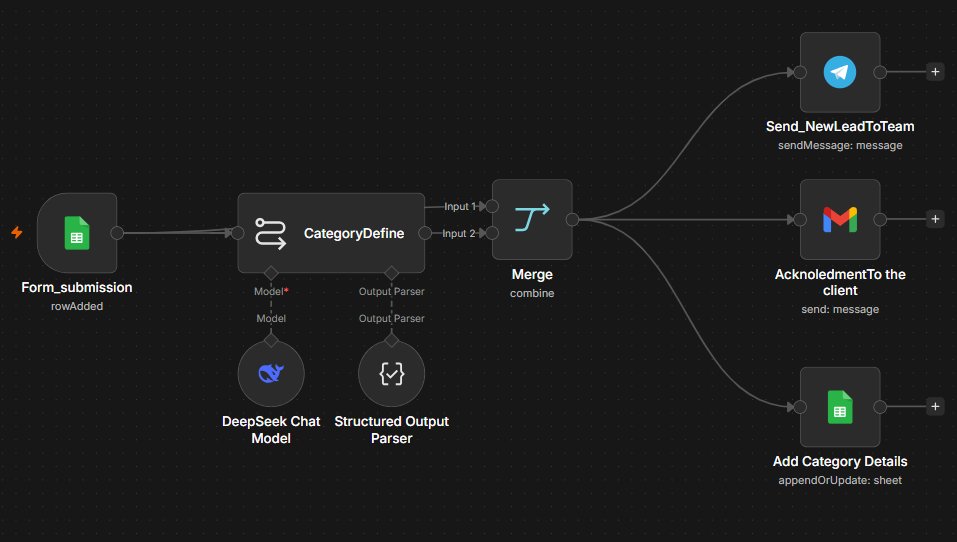

# AI lead qualification and routing

A new row in Google Sheets (from a form) is scored by AI, then the team is alerted, the sender gets an acknowledgement, and the scored result is saved. The last three steps run in parallel.

## Flow
1. **Google Sheets Trigger** fires when a new form row is added.
2. **LLM chain (DeepSeek)** scores category, intent, budget, urgency and priority.
3. **Structured Output Parser** forces clean JSON from the model.
4. **Merge** combines the original form data with the AI result.
5. In parallel: **Telegram** alert, **Gmail** acknowledgement, **Google Sheets** log.

## Setup
1. In n8n, create a new workflow and paste in the contents of `workflow.json` (or use Import from File).
2. Add your own credentials: Google Sheets, DeepSeek, Telegram, Gmail.
3. Replace the placeholders: `YOUR_DOCUMENTID` / `YOUR_SHEETNAME` (your sheets) and `YOUR_CHATID` (your Telegram chat).
